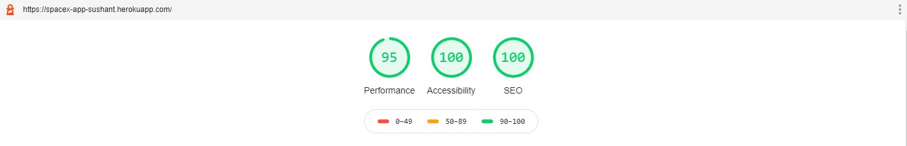
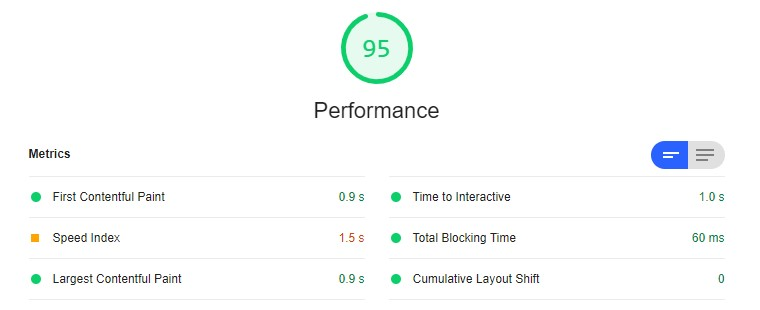
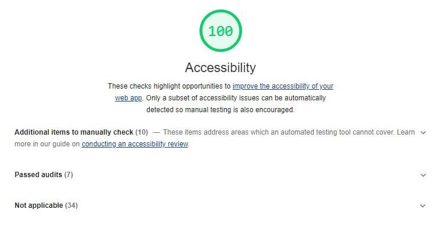
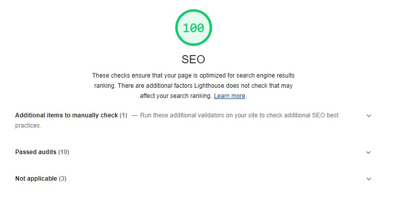

SpaceX Launch Programs React Application project was bootstrapped with [Create React App](https://github.com/facebook/create-react-app)

# Problem statement
To develop a web application which loads all the SpaceX Launch Programs in the User Interface using external REST APIs provided.

# Approach
Approach to create this application are as follows :
1. Firstly, setting up the project folder to store all the components, containers, pages and other services seperately.
2. `react-redux` has been used to manage the application states from one single store.
3. `redux-thunk` middleware was setup to call action creators that return a function instead of an action object.
3.  `redux-sessionstorage` stores the states in browser session storage, using which we can easily fetch the application states across the application.
4. External API calls have been mentioned in `externalServices.js` file under `src/services/` which are exported and used while calling redux actions. In order to prevent CORS issue while calling the APIs, `https://cors-anywhere.herokuapp.com/` URL was embedded before the actual API endpoint.
5. There are three seperate action types which calls action for fetching all programs, fetch filtered results and to check app's loading state.
6. The actions then dispatch payloads according to the action type used and updates the application state which contains app loading state `isLoading` and program list `programs`.
---
# Setup the project

### Clone the project from the git repo
```sh
$ git clone https://github.com/sushant049/spacex-react-app.git .
```

### Install the required packages
```sh
$ npm install
```

----

# Available Scripts

In the project directory, you can run:

### Run in development mode
```sh
$ npm start
```
Runs the app in the development mode.
Open [http://localhost:3000](http://localhost:3000) to view it in the browser.

### Generate production ready build
```sh
$ npm run build
```
Creates a production build of the application under build folder


The page will reload if you make edits.
You will also see any lint errors in the console.

---
## Deployment to Heroku
The application is hosted on Heroku using Heroku CLI and attaching react-app-buildpack while deployinng the code

### Steps
Here are the steps to deploy a create-react-app directly to Heroku :
1. Install Heroku CLI and login
````
$ heroku login
````
2. Create a Heroku app and attach the create-react-app buildpack to it
````
$ heroku create spacex-app-sushant --buildpack https://github.com/mars/create-react-app-buildpack.git
````

3. Create a file `static.json` in the project root and add following contents

````
{
  "root": "build/",
  "clean_urls": false,
  "routes": {
    "/**": "index.html"
  }
}
````
4. Deploy your changes
````
$ git add .
$ git commit -am "SpaceX Programs React Application"
$ git push heroku master
````

5. View the deployed application
````
$ heroku open
````


---
## Chrome LightHouse Reports

### Summary Report


### Detailed Performance Report


### Detailed Accessibility Report


### Detailed SEO Report


---

Deployed application URL : https://spacex-app-sushant.herokuapp.com/